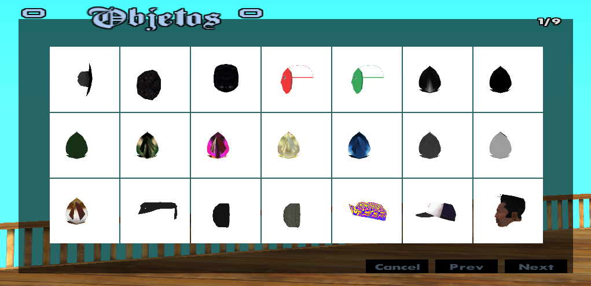
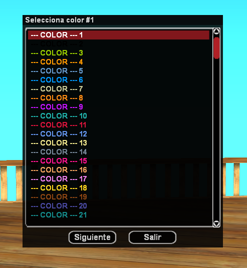
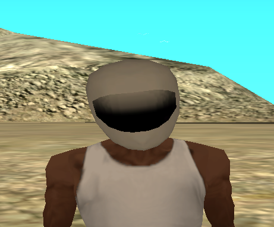
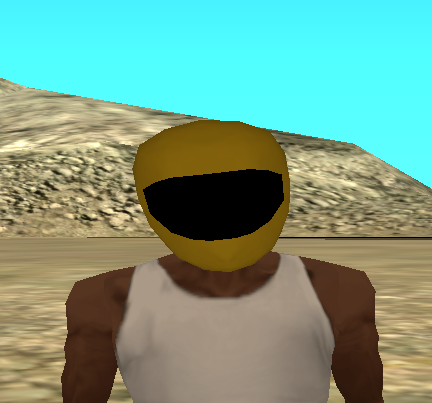
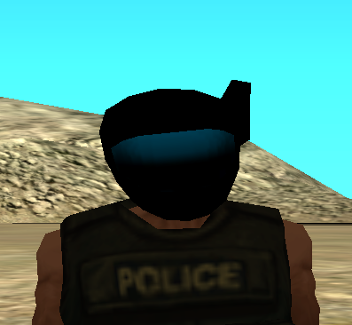
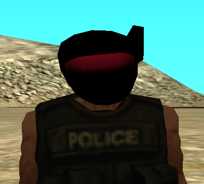

<h1 align="center"> Player Object System - Sistema de Objetos para el jugador</h1>

**Este sistema de Objetos/Juguetes/Items incluye funciones para personalizar tus objetos dentro del servidor. Al usar el comando `/objetos` se abre el menú de personalización donde los jugadores pueden elegir un objeto de la lista o ingresar un ID personalizado, seleccionar dos colores en un panel de `+150 colores`, definir el hueso del cuerpo donde se colocará y acceder al editor para mover, rotar, dimensionar y guardar el objeto. Gracias a la integración con la base de datos, cada objeto se guarda y se recarga automáticamente al reconectar, permitiendo que los jugadores ajusten su apariencia a su gusto. Garantizando una experiencia estable y personalizada en el servidor.**

## 🎨 Colores (Objetos) [Imagenes - Pictures]

**Explicación: El objeto Casco Blanco (18978) modificado a algunos colores de la lista disponible de +150 Colores**  

---

**Objeto - Casco Blanco Colores Originales (18978)**

---

**Objeto - Casco Blanco Colores Amarillo & Negro (18978)**

---

**Objeto - Casco Blanco Colores Negro & Azul (18978)**

---

**Objeto - Casco Blanco Colores Negro & Rojo (18978)**

## _Comando_

  `/objetos` - Abre el  menú de personalización!  
  
### Atajos de Comandos

  `/hold` -> **/objetos**  
  `/o` -> **/objetos**   
  `/items` -> **/objetos**  
  `/prendas` -> **/objetos**  
  
## Aclaración

**Puede modificar o ajustar cualquier parte del sistema si lo necesita, añadir más colores, agregar más objetos y ampliar las funciones. También puede corregir textos, mejorar las funciones o agregar detalles que crea útiles. Así podrá adaptarlo mejor a su proyecto o a la forma en que prefiera que funcione el sistema.**

## Creditos

- Desarrollador **(Straydet)** -> *(Funciones añadidas, mejoras y demás)*
- [Idea y versión original](https://sampforum.blast.hk/showthread.php?tid=641006) - **(EdgarHN)**
